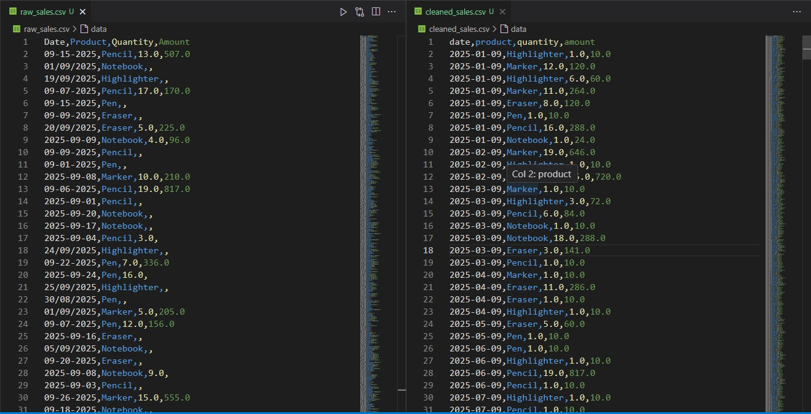

# 🧹 Excel Automation & Data Cleaning Showcase

**Automating and cleaning messy Excel/CSV files using Python & Pandas to save you time, reduce errors, and help make better business decisions.**

---

## 📂 What’s Inside This Repo

I’ve built **three sample projects** showing how messy data can be turned into business-ready output:

| Project | What it does | Files included |
|--------|----------------|----------------|
| **data_cleaning** | Takes a raw CSV or Excel sheet with duplicates / format issues, and outputs a cleaned version | `raw_sales.csv`, `cleaned_sales.csv`, `clean_data.py` |
| **sales_report** | Converts a sales CSV into a formatted Excel report with summary & charts | `sales_data.csv`, `report_generator.py`, `report_output.xlsx` |
| **automation_script** | Automates a small business task (e.g. invoice or summary automation) | `automate_invoice.py`, `sample_invoice.xlsx` |

---

## 🧠 Why This is Useful

Many small businesses spend hours manually cleaning or formatting data, making reports, or copying between sheets. With automation:

- ✅ You save **hours every week**  
- ✅ Errors are reduced  
- ✅ You get clean, usable data & visuals  
- ✅ You don’t need to hire a full-time analyst  

All examples here are built for real business pain points, not theoretical code.

---

## 👀 How It Works (in Simple Steps)

Here’s the typical workflow I use (and you’ll see in these scripts):

1. Load your raw data (Excel / CSV)  
2. Detect & fix common issues (duplicates, wrong formats, missing values)  
3. Reformat columns / standardize (dates, text)  
4. Save a cleaned output file  
5. (Optional) Generate summary / charts / dashboard  

You don’t need to understand every line of code — just send me your file, I’ll run these steps, and send you cleaned data or reports.

---

## 📸 Before & After (Visuals)

> *(Insert screenshots here – e.g. messy sheet side-by-side with cleaned version, or a chart generated)*  
>
> 

---

## 📬 How You Can Try It / Hire Me

1. **Download a sample “raw” file** from this repo  
2. Run the corresponding Python script (`.py`) — it will generate the “cleaned” file or report  
3. See the result — if you like it, send me *your* file and I’ll run it for you  
4. For paid work: tasks start at **₹500**  

**First 2 clients get a discount / special rate** (because I’m building reputation)

---

## 🗣 Demo Feedback / Test Result

💬 “I tested this script on a messy sales file with over 500 rows. It cleaned the data, removed duplicates, and generated a monthly summary in under 2 seconds — saving at least 2 hours of manual work.”

👉 These are internal test results for demonstration purposes. I’ll update this section with real client feedback as I start working with small businesses.

---

## 📲 Contact / Hire Me

📩 Instagram: [@still_loading_cse346](https://www.instagram.com/still_loading_cse346/)  
📩 Facebook: [Still Loading](https://m.facebook.com/still.loading.592215/)  

DM me with your file or ask for a free demo. I’m happy to show you before you pay.

---

## ⚖️ License & Disclaimer

This code is released under the MIT License. Use it for learning or business at your own risk. I don’t guarantee perfect results for all data — but I’ll try my best for your file.

---

*Built with the aim to help small businesses in India manage their data better — even if they can’t afford big analytics firms.*  
